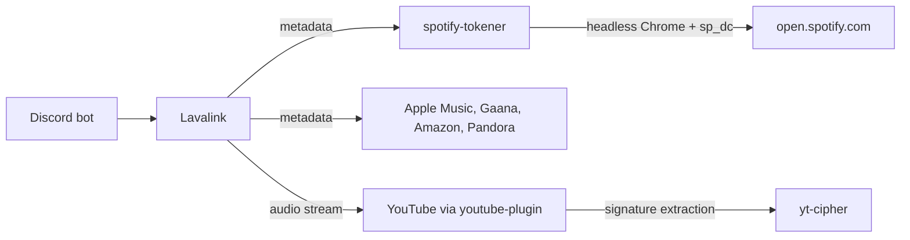

# Lavalink with Spotify Metadata (No Premium Required)

A working Lavalink v4 configuration that resolves Spotify tracks, albums and editorial playlists
without an active Spotify Premium subscription, plus the self-hosted token service it depends on.

Audio is never taken from Spotify. Spotify supplies metadata only, and playback is mirrored through
YouTube. This is what makes the setup viable without Premium.

## Contents

- [Why this exists](#why-this-exists)
- [Available sources](#available-sources)
- [How it works](#how-it-works)
- [Prerequisites](#prerequisites)
- [Step 1: Deploy the token service](#step-1-deploy-the-token-service)
- [Step 2: Obtain your sp_dc cookie](#step-2-obtain-your-sp_dc-cookie)
- [Step 3: Configure Lavalink](#step-3-configure-lavalink)
- [Step 4: Verify](#step-4-verify)
- [Production hardening](#production-hardening)
- [Pinned versions and why](#pinned-versions-and-why)
- [Troubleshooting](#troubleshooting)
- [Terms of service](#terms-of-service)

## Why this exists

Spotify restricted Development Mode in February 2026. Applications in Development Mode now require
the **app owner** to hold an active Premium subscription. Without it, every Web API endpoint returns
HTTP 403:

```json
{ "error": { "status": 403, "message": "Active premium subscription required for the owner of the app." } }
```

Extended Quota Mode removes that restriction but is effectively closed to individuals. Since
15 May 2025 it requires a company application, a launched service and a minimum of 250,000 monthly
active users.

This configuration routes Spotify lookups through the Spotify web player token instead of the
public Web API. The web player serves metadata to free accounts, so track, album and editorial
playlist resolution keeps working when the developer application is dead.

> [!IMPORTANT]
> Spotify client credentials are still present in the config and are still used as a fallback.
> If the app owner has Premium, both paths work and the setup is more resilient. If not, the
> token service path carries everything on its own.

## Available sources

Built-in sources enabled in `lavalink.server.sources`:

| Source | Enabled | Notes |
| --- | --- | --- |
| `bandcamp` | Yes | |
| `soundcloud` | Yes | `scsearch:` |
| `twitch` | Yes | |
| `vimeo` | Yes | |
| `http` | Yes | Direct stream URLs |
| `local` | Yes | Local filesystem |
| `youtube` | **No** | Deliberately disabled, replaced by `youtube-plugin` |

> [!WARNING]
> Keep the built-in `youtube` source set to `false`. Leaving it enabled alongside `youtube-plugin`
> registers two competing YouTube source managers.

Sources added by plugins:

| Prefix / Pattern | Source | Provided by |
| --- | --- | --- |
| `ytsearch:` `ytmsearch:` | YouTube, YouTube Music | `youtube-plugin` |
| `spsearch:` | Spotify | LavaSrc |
| `amsearch:` | Apple Music | LavaSrc |
| `dzsearch:` | Deezer | LavaSrc |
| `ftts://` | Flowery TTS | LavaSrc |
| `gaanasearch:` | Gaana | `gaana-plugin` |
| `amzsearch:` | Amazon Music | NothingLink |
| `pdsearch:` `pdrec:` | Pandora, Pandora recommendations | NothingLink |
| `speak:` | Text to speech | DuncteBot |
| `clypit:` `getyarn:` `mixcloud:` `ocremix:` `pixeldrain:` `reddit:` `soundgasm:` | Misc audio hosts | DuncteBot |

Available in LavaSrc but disabled by default in this config because each needs its own credentials:
`jiosaavn`, `qobuz`, `tidal`, `vkmusic`, `yandexmusic`, `ytdlp`.

Lyrics are exposed through LavaLyrics with `lrcLib`, `spotify` and `youtube` enabled. LavaSearch adds
the extended search endpoint. SponsorBlock adds segment skipping.

> [!NOTE]
> `ytdlp` must stay `false` unless you install a `yt-dlp` binary on every node. Enabling it registers
> a second source manager named `youtube`, which shadows `youtube-plugin` and breaks YouTube playback
> along with every source that mirrors through it.

## How it works



Spotify, Apple Music, Amazon Music and Pandora are all mirror sources. They resolve metadata, then
Lavalink finds the audio on YouTube using the ISRC first and the title second:

```yaml
providers:
  - ytsearch:"%ISRC%"
  - ytsearch:%QUERY%
```

The practical consequence is that YouTube playback health determines the health of almost every
source. If YouTube breaks, Spotify appears to break too.

## Prerequisites

- Lavalink v4 (tested against 4.2.2)
- Java 17 or newer
- Docker and the Compose plugin, for the token service
- A Spotify account. Free is sufficient for metadata
- A Spotify developer application for `clientId` and `clientSecret`

## Step 1: Deploy the token service

The token service is [`topi314/spotify-tokener`](https://github.com/topi314/spotify-tokener), written
by the author of LavaSrc. It runs a real headless Chrome against `open.spotify.com` and returns the
access token the web player uses.

<details>
<summary><b>Option A: shared Docker network (recommended)</b></summary>

If Lavalink also runs in Docker, put both on the same network and address the service by container
name. No published port and no firewall rules are required.

```bash
docker network create lavalink_net   # skip if it already exists
docker compose -f tokener/docker-compose.shared-network.yml up -d
```

Then in `application.yml`:

```yaml
customTokenEndpoint: http://spotify-tokener:8080/api/token
```

</details>

<details>
<summary><b>Option B: published port</b></summary>

Use this when Lavalink runs outside Docker, or in a container you do not control, for example under
a game panel.

```bash
docker compose -f tokener/docker-compose.yml up -d
```

Confirm it responds. Chrome takes roughly 60 seconds to warm up on first start:

```bash
curl -s http://127.0.0.1:8099/api/token
```

```json
{ "accessToken": "BQ...", "accessTokenExpirationTimestampMs": 1789926052566, "isAnonymous": true }
```

</details>

> [!CAUTION]
> When Lavalink runs inside a container and the token service is published on the host, address the
> host through the Docker bridge gateway, not the host's public IP.
>
> ```yaml
> customTokenEndpoint: http://172.18.0.1:8099/api/token
> ```
>
> A container that dials the host's own public address sends the packet out and back in on the
> physical interface, where a firewall rule intended for external traffic will drop it. The symptom
> is a 40 to 90 second hang followed by a generic lookup error, while the same URL works fine from
> any other machine. Find your gateway with:
>
> ```bash
> docker network inspect <network> -f '{{range .IPAM.Config}}{{.Gateway}}{{end}}'
> ```

## Step 2: Obtain your sp_dc cookie

`sp_dc` is a long lived Spotify session cookie. Relaying it to the token service upgrades an
anonymous token to an account token, which is what unlocks editorial playlists such as
`37i9dQZF1DXcBWIGoYBM5M`.

1. Open a **private or incognito** window.
2. Go to `https://accounts.spotify.com/en/login?continue=https%3A%2F%2Fopen.spotify.com%2F` and log in.
3. Open developer tools, then **Application**, then **Cookies**, then `https://open.spotify.com`.
4. Copy the value of `sp_dc`.
5. Close the window **without logging out**. Logging out invalidates the cookie immediately.

Verify it produces an account token:

```bash
curl -s -H "Cookie: sp_dc=YOUR_SP_DC" http://127.0.0.1:8099/api/token | grep isAnonymous
```

| Response | Meaning |
| --- | --- |
| `"isAnonymous": false` | Correct. Account token issued, editorial playlists will resolve |
| `"isAnonymous": true` | Cookie missing, expired or rejected. Editorial playlists will fail |

> [!NOTE]
> Independent projects consistently report a validity period of about one year. Treat that as a
> ceiling rather than a guarantee. Changing your password, using "sign out everywhere", or logging
> out of the originating browser session all invalidate it early.

## Step 3: Configure Lavalink

Copy `lavalink/application.yml` next to your `Lavalink.jar` and replace each placeholder:

| Placeholder | Where to get it |
| --- | --- |
| `CHANGE_ME_LAVALINK_PASSWORD` | Any value you choose. Must not be empty or `null` |
| `SPOTIFY_CLIENT_ID` | https://developer.spotify.com/dashboard |
| `SPOTIFY_CLIENT_SECRET` | Same application |
| `SPOTIFY_SP_DC_COOKIE` | [Step 2](#step-2-obtain-your-sp_dc-cookie) |
| `APPLE_MUSIC_MEDIA_API_TOKEN` | Public token in the `music.apple.com` web bundle |
| `YOUTUBE_OAUTH_REFRESH_TOKEN` | Google OAuth device flow, or leave `null` to disable |
| `DEEZER_ARL` | Your own Deezer session cookie |
| `DEEZER_MASTER_DECRYPTION_KEY` | Not supplied here. Leave as is or set `deezer: false` |

> [!WARNING]
> An empty or `null` Lavalink `password` makes the node unreachable. Every request returns 401 or 403.
>
> A placeholder or invalid `refreshToken` prevents startup with
> `Invalid status code for oauth2 token fetch: 400`. Use `refreshToken: null` to disable OAuth cleanly.

Settings that matter more than they look:

| Setting | Value | Reason |
| --- | --- | --- |
| `preferPartnerApi` | `true` | Routes Spotify through the token service instead of the Web API |
| `resolveArtistsInSearch` | `false` | LavaSrc otherwise batch calls `/v1/artists`, removed for Development Mode apps in February 2026. Leaving it `true` returns 403 on every search |
| `remoteCipher.url` | set | Offloads YouTube signature extraction. Required in practice, see below |
| `flowerytts.voice` | set | Startup fails with `Default voice must be set` if absent |

### YouTube signature extraction

YouTube rotates its player script. When local extraction cannot parse a new one, the log shows:

```
Client [TVHTML5] failed: Must find sig function from script: /s/player/<hash>/player_embed.vflset/en_GB/base.js
```

`TVHTML5` is the only OAuth capable client, so once it fails the remaining clients hit the login wall
and every track fails with `AllClientsFailedException`. Delegating extraction to
[`kikkia/yt-cipher`](https://github.com/kikkia/yt-cipher) fixes this without waiting for a plugin
release:

```yaml
remoteCipher:
  url: "https://cipher.kikkia.dev/"
  password: ""
  userAgent: "your-service-name"
```

A public instance is available at `https://cipher.kikkia.dev/` and requires no password. Self-host
`yt-cipher` if you would rather not depend on a third party service at runtime.

## Step 4: Verify

`loadtracks` alone is not sufficient. It proves a track resolved, not that it plays. Resolution keeps
succeeding on builds where playback is completely broken.

`scripts/playtest.py` attaches a real player over the websocket and reports the result:

```bash
pip install websockets

./scripts/playtest.py --host localhost:2333 --password YOUR_PASSWORD --set youtube
./scripts/playtest.py --host localhost:2333 --password YOUR_PASSWORD --set sources
```

```
https://www.youtube.com/watch?v=kJQP7kiw5Fk    PLAYS   [Luis Fonsi - Despacito ft.]

PLAYBACK: 6/6 passing
```

> [!TIP]
> A pass means the track started **and survived the grace window**. `TrackStartEvent` fires before
> the audio format is resolved, so a naive test that stops at the start event reports success for
> tracks that fail a fraction of a second later. A verdict of `STARTED then EXCEPTION` is a failure.

Exit codes are `0` for all passing, `2` for partial failure and `1` for a connection problem, which
makes the script usable from cron or CI.

> [!TIP]
> Do not validate YouTube using `dQw4w9WgXcQ` alone. It passes on builds where everything else fails.
> The `--set youtube` list contains six videos chosen because they expose real breakage.

## Production hardening

### Restrict access to the token service

Option B publishes the port on all interfaces. Anyone who can reach it can mint anonymous Spotify
tokens using your server. The supplied script allowlists source addresses using the `DOCKER-USER`
chain, which Docker consults before its own rules.

```bash
sudo cp tokener/tokener-fw.sh /usr/local/bin/
sudo chmod +x /usr/local/bin/tokener-fw.sh
sudo cp tokener/tokener-allow.list.example /etc/tokener-allow.list
sudo nano /etc/tokener-allow.list

sudo cp tokener/tokener-fw.service /etc/systemd/system/
sudo sed -i "s/NIC=eth0/NIC=$(ip route get 1.1.1.1 | grep -oP 'dev \K\S+')/" \
  /etc/systemd/system/tokener-fw.service
sudo systemctl enable --now tokener-fw.service
```

The rules match the **container** port, 8080, not the published port. They are also scoped to the
physical interface so that same host container traffic through the bridge gateway is unaffected.

> [!NOTE]
> Docker rebuilds its chains when the daemon restarts. The unit is ordered `After=docker.service` so
> the rules are reapplied. Cloud provider firewalls and security groups are separate and should be
> tightened as well.

### Watchdog

Chrome inside the token service can stop responding after roughly an hour while the container still
reports a healthy `Up` status. Docker restart policies never trigger, because the process has not
exited. The watchdog probes the real endpoint and restarts only on genuine failure.

```bash
sudo cp tokener/tokener-watchdog.sh /usr/local/bin/
sudo chmod +x /usr/local/bin/tokener-watchdog.sh
sudo cp tokener/tokener-watchdog.cron /etc/cron.d/tokener-watchdog
sudo chmod 644 /etc/cron.d/tokener-watchdog
```

It retries once before acting, because a cold Chrome start legitimately takes about 60 seconds.
Activity is logged to `/var/log/tokener-watchdog.log`.

## Pinned versions and why

| Dependency | Version | Reason for pinning |
| --- | --- | --- |
| `dev.lavalink.youtube:youtube-plugin` | `f45bbb7aebfcbc1c553769e04af6cd43afa8b7c3` | Snapshot from the snapshots repository. Contains the PlayStation 4 user agent fix for the TV client. Release 1.18.2 does not, and OAuth playback fails without it |
| `com.github.topi314.lavasrc:lavasrc-plugin` | `4.8.3` | Current release |
| `com.dunctebot:skybot-lavalink-plugin` | `1.7.0` | **Not 1.7.1.** The 1.7.1 artifact ships with no source manager classes and fails at startup with `ClassNotFoundException` |
| `com.github.Ankush26030:NothingLink` | `be87d98` | Commit, not release. Release v1.0.6 predates the Amazon Music API base URL fix and returns empty results |
| `com.github.notdeltaxd:gaana-plugin` | `1.0.2` | Current release |

> [!NOTE]
> Lavalink's update checker reports a "newer version" when a plugin is pinned to a commit hash.
> That warning is cosmetic. Full 40 character hashes are required, abbreviated hashes return 404.

## Troubleshooting

| Symptom | Likely cause |
| --- | --- |
| Spotify search works, albums and playlists fail | Token service unreachable, or `sp_dc` expired. Check `isAnonymous` |
| All Spotify requests return 403 | App owner has no Premium. The token service path bypasses this |
| `isAnonymous` is `true` despite sending the cookie | Cookie expired or was invalidated by logging out |
| Lookup hangs 40 to 90 seconds, then errors | `customTokenEndpoint` uses the host public IP from inside a container. Use the bridge gateway |
| `Must find sig function from script` | YouTube rotated its player. Enable `remoteCipher` |
| `This video requires login` on every client | `TVHTML5` failed first, usually the cipher problem above |
| `AllClientsFailedException` | Every YouTube client failed. Inspect the per client reasons in the log |
| `ClassNotFoundException` at startup | DuncteBot 1.7.1. Downgrade to 1.7.0 |
| `Default voice must be set` | `flowerytts.voice` is missing |
| Every request returns 401 or 403 | Lavalink `password` is empty or `null` |
| YouTube and all mirror sources fail together | Expected. Spotify, Apple Music, Amazon and Pandora mirror through YouTube |
| `amzsearch:` returns empty | Amazon changed its API. Check for a newer NothingLink commit |

Log inspection tips:

```bash
# strip ANSI colour codes, otherwise grep silently misses matches
sed -r "s/\x1B\[[0-9;]*[mGKH]//g" logs/spring.log | grep -i "requires login"

# isolate the current boot when a log spans several restarts
awk '/Starting Launcher/{buf=""} {buf=buf$0 ORS} END{printf "%s", buf}' logs/spring.log
```

## Terms of service

Reading metadata through the Spotify web player token is **not permitted** under the Spotify
Developer Terms and Developer Policy. The token service returns this disclaimer in every response:

```
Usage of this endpoint is not permitted under the Spotify Developer Terms
and Developer Policy, and applicable law
```

The relevant clause prohibits using "any robot, spider, site search/retrieval application, or other
tool to retrieve, duplicate, or index any portion of the Spotify Service or Spotify Content (which
includes playlist data)". Obtaining credentials outside the provided authorization flow is also
prohibited.

For clarity about what this does and does not involve:

- No audio is retrieved from Spotify. No content protection is circumvented. This is not stream ripping
- The `sp_dc` cookie is your own session. The practical risk sits with your own account, which Spotify
  may log out or action
- Undocumented endpoints change without notice, so expect breakage

Use your own account and your own credentials, and understand the trade before deploying this.

## Credits

- [Lavalink](https://github.com/lavalink-devs/Lavalink)
- [youtube-source](https://github.com/lavalink-devs/youtube-source)
- [LavaSrc](https://github.com/topi314/LavaSrc), [spotify-tokener](https://github.com/topi314/spotify-tokener), [LavaSearch](https://github.com/topi314/LavaSearch), [LavaLyrics](https://github.com/topi314/LavaLyrics)
- [yt-cipher](https://github.com/kikkia/yt-cipher)
- [NothingLink](https://github.com/Ankush26030/NothingLink)
- [gaana-plugin](https://github.com/notdeltaxd/gaana-plugin)
- [DuncteBot plugin](https://github.com/DuncteBot/skybot-lavalink-plugin)
