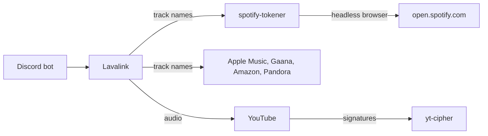

# Lavalink with Spotify Metadata (No Premium Required)

A complete, working Lavalink v4 setup that plays music from Spotify links, Apple Music, YouTube,
SoundCloud and more, **without needing a Spotify Premium subscription**.

Copy the config, run one Docker container, fill in four values, and you have a working audio node
for your Discord bot.

> [!NOTE]
> Spotify is only used to read track names, artists and playlists. The actual audio is streamed from
> YouTube. That is the reason this works without Premium.

## Table of contents

- [Before you start](#before-you-start)
- [Setup](#setup)
  - [1. Install Java and Docker](#1-install-java-and-docker)
  - [2. Download this repository](#2-download-this-repository)
  - [3. Download Lavalink](#3-download-lavalink)
  - [4. Start the Spotify token service](#4-start-the-spotify-token-service)
  - [5. Get your sp_dc cookie](#5-get-your-sp_dc-cookie)
  - [6. Get your Spotify client ID and secret](#6-get-your-spotify-client-id-and-secret)
  - [7. Fill in the config](#7-fill-in-the-config)
  - [8. Start Lavalink](#8-start-lavalink)
  - [9. Test that it works](#9-test-that-it-works)
  - [10. Connect your bot](#10-connect-your-bot)
- [Available sources](#available-sources)
- [Optional: production hardening](#optional-production-hardening)
- [Troubleshooting](#troubleshooting)
- [Reference](#reference)
- [Terms of service](#terms-of-service)

## Before you start

You need:

- [ ] A Linux server or VPS. This guide uses Ubuntu 22.04 or 24.04
- [ ] Root or `sudo` access
- [ ] A Spotify account. **A free account is fine**
- [ ] About 20 minutes

You do **not** need Spotify Premium, and you do not need to be an experienced developer. Every
command below can be copied and pasted as it is written.

> [!TIP]
> If a command fails, look at [Troubleshooting](#troubleshooting) before trying something different.
> Most problems have one specific cause and a one line fix.

## Setup

### 1. Install Java and Docker

Lavalink needs Java 17 or newer. The token service runs in Docker.

```bash
sudo apt update
sudo apt install -y openjdk-17-jre-headless docker.io docker-compose-v2 git curl
```

Check both installed correctly:

```bash
java -version
docker --version
```

Expected output, version numbers may differ slightly:

```
openjdk version "17.0.20" 2026-01-20
Docker version 29.1.3, build afdd53b
```

Let your user run Docker without `sudo`, then apply it:

```bash
sudo usermod -aG docker $USER
newgrp docker
```

### 2. Download this repository

```bash
cd ~
git clone https://github.com/Aelshi-nui/spotify-meta-data.git
cd spotify-meta-data
ls
```

Expected output:

```
LICENSE  README.md  lavalink  scripts  tokener
```

### 3. Download Lavalink

Create a working folder and download the official Lavalink jar into it:

```bash
mkdir -p ~/lavalink
cd ~/lavalink
curl -L -o Lavalink.jar \
  https://github.com/lavalink-devs/Lavalink/releases/latest/download/Lavalink.jar
```

Copy the config from this repository next to the jar:

```bash
cp ~/spotify-meta-data/lavalink/application.yml ~/lavalink/application.yml
ls -lh ~/lavalink
```

Expected output, roughly 95 MB for the jar:

```
-rw-rw-r-- 1 ubuntu ubuntu  96M Lavalink.jar
-rw-rw-r-- 1 ubuntu ubuntu 5.2K application.yml
```

> [!NOTE]
> You do not need to download any plugins. Lavalink reads the plugin list from `application.yml`
> and downloads them itself the first time it starts.

### 4. Start the Spotify token service

This small service is what lets Spotify work without Premium. It runs a headless browser and hands
Lavalink the same access token the Spotify web player uses.

```bash
cd ~/spotify-meta-data/tokener
docker compose up -d
```

Check it is running:

```bash
docker ps
```

Expected output:

```
CONTAINER ID   IMAGE                                    STATUS         PORTS
a1b2c3d4e5f6   ghcr.io/topi314/spotify-tokener:master   Up 10 seconds  0.0.0.0:8099->8080/tcp
```

Now test it. The first request takes up to 60 seconds because the browser has to start up, so be
patient here:

```bash
curl -s http://127.0.0.1:8099/api/token
```

Expected output:

```json
{"accessToken":"BQC...","accessTokenExpirationTimestampMs":1789926052566,"isAnonymous":true}
```

If you see `accessToken`, this step is done. `isAnonymous` being `true` is correct for now. You will
change that in the next step.

<details>
<summary><b>If the command returns nothing or hangs</b></summary>

The browser may still be starting. Wait 60 seconds and try again. If it still fails, check the logs:

```bash
docker logs spotify-tokener
```

A healthy service logs:

```
INFO Server started address=0.0.0.0:8080
```

</details>

### 5. Get your sp_dc cookie

`sp_dc` is a login cookie from your own Spotify account. Giving it to the token service is what
unlocks playlists such as Today's Top Hits.

1. Open a **private window** or **incognito window** in your browser.
2. Go to this address and log in to Spotify:
   ```
   https://accounts.spotify.com/en/login?continue=https%3A%2F%2Fopen.spotify.com%2F
   ```
3. Once logged in, press <kbd>F12</kbd> to open developer tools.
4. Go to the **Application** tab. In Firefox this tab is called **Storage**.
5. In the left sidebar, expand **Cookies**, then click `https://open.spotify.com`.
6. Find the row named `sp_dc` and copy its **Value**. It is a long string of random characters.
7. **Close the private window without clicking log out.** Logging out immediately breaks the cookie.

Now check that your cookie works. Replace `PASTE_COOKIE_HERE` with the value you copied:

```bash
curl -s -H "Cookie: sp_dc=PASTE_COOKIE_HERE" http://127.0.0.1:8099/api/token | grep isAnonymous
```

| What you see | What it means |
| --- | --- |
| `"isAnonymous":false` | Correct. Your cookie works, continue to the next step |
| `"isAnonymous":true` | The cookie was not accepted. Repeat this step carefully, especially point 7 |

> [!IMPORTANT]
> Keep this cookie private. It is a login session for your Spotify account. Never commit it to Git
> and never post it anywhere.

### 6. Get your Spotify client ID and secret

1. Go to https://developer.spotify.com/dashboard and log in.
2. Click **Create app**.
3. Fill in any name and description.
4. For **Redirect URI** enter `http://localhost:8080`. It is not used, but the form requires one.
5. Tick the Web API checkbox, then click **Save**.
6. Open your new app, click **Settings**.
7. Copy the **Client ID**.
8. Click **View client secret** and copy the **Client secret**.

> [!NOTE]
> These are still worth setting even though Spotify now requires the app owner to have Premium for
> its public API. If you ever get Premium, this becomes a working backup path. Without Premium the
> token service from step 4 does all the work on its own.

### 7. Fill in the config

Open the config file:

```bash
nano ~/lavalink/application.yml
```

Find and replace these four values. In `nano`, use <kbd>Ctrl</kbd>+<kbd>W</kbd> to search.

| Find this text | Replace with |
| --- | --- |
| `CHANGE_ME_LAVALINK_PASSWORD` | Any password you invent. Your bot will use this to connect |
| `SPOTIFY_CLIENT_ID` | The Client ID from step 6 |
| `SPOTIFY_CLIENT_SECRET` | The Client secret from step 6 |
| `SPOTIFY_SP_DC_COOKIE` | The `sp_dc` cookie from step 5 |

Save with <kbd>Ctrl</kbd>+<kbd>O</kbd>, <kbd>Enter</kbd>, then exit with <kbd>Ctrl</kbd>+<kbd>X</kbd>.

Now set the token service address. **Pick the row that matches your situation:**

| How you run Lavalink | Set `customTokenEndpoint` to |
| --- | --- |
| Directly on the server, as in this guide | `http://127.0.0.1:8099/api/token` |
| Inside a Docker container | `http://172.18.0.1:8099/api/token` |

If you followed this guide exactly, use the first row:

```bash
sed -i 's|customTokenEndpoint: .*|customTokenEndpoint: http://127.0.0.1:8099/api/token|' \
  ~/lavalink/application.yml
grep customTokenEndpoint ~/lavalink/application.yml
```

> [!CAUTION]
> If Lavalink runs in a container, do **not** use your server's public IP address here. A container
> calling its own host's public address gets blocked by the host firewall, and the only symptom is
> Spotify albums and playlists timing out after about 40 seconds. Use the Docker gateway address
> instead. Find yours with:
>
> ```bash
> docker network inspect bridge -f '{{range .IPAM.Config}}{{.Gateway}}{{end}}'
> ```

> [!NOTE]
> Apple Music works out of the box. The `mediaAPIToken` in the config is the public token Apple
> serves to every visitor of `music.apple.com`, so it is not a secret. It does expire, currently on
> 20 November 2026. When Apple Music stops working, fetch a fresh one:
>
> ```bash
> curl -sL https://music.apple.com/us/new \
>   | grep -oE '/assets/[A-Za-z0-9~._/-]+\.js' | sort -u \
>   | while read f; do curl -s "https://music.apple.com$f" \
>       | grep -oE 'eyJ[A-Za-z0-9_-]{30,}\.[A-Za-z0-9_-]{60,}\.[A-Za-z0-9_-]{20,}' | head -1; done \
>   | head -1
> ```

Leave everything else in the file alone. The other placeholders are for optional sources you do not
need to set up now.

<details>
<summary><b>Optional values you can fill in later</b></summary>

| Placeholder | What it enables | How to get it |
| --- | --- | --- |
| `DEEZER_ARL` | Deezer, `dzsearch:` | Your own Deezer login cookie |
| `DEEZER_MASTER_DECRYPTION_KEY` | Deezer audio | Not provided here |

If you are not using Deezer, turn it off to avoid errors in the log. Open the config, find
`deezer: true` under `sources:` and change it to `deezer: false`.

</details>

### 8. Start Lavalink

```bash
cd ~/lavalink
java -jar Lavalink.jar
```

The first start takes a minute or two because Lavalink downloads its plugins. You will see lines
like this scroll past:

```
Loaded 'youtube-plugin-f45bbb7aebfcbc1c553769e04af6cd43afa8b7c3.jar'
Loaded 'lavasrc-plugin-4.8.3.jar'
Loaded 'NothingLink-be87d98.jar'
```

When you see this line, Lavalink is ready:

```
Lavalink is ready to accept connections.
```

Leave this terminal open for now. Press <kbd>Ctrl</kbd>+<kbd>C</kbd> to stop it.

#### Finish the YouTube sign in

On first start you will also see this in the log:

```
==================================================
!!! DO NOT AUTHORISE WITH YOUR MAIN ACCOUNT, USE A BURNER !!!
OAUTH INTEGRATION: To give youtube-source access to your account, go to
https://www.google.com/device and enter code VTQ-PYW-JJNP
!!! DO NOT AUTHORISE WITH YOUR MAIN ACCOUNT, USE A BURNER !!!
==================================================
```

YouTube blocks most playback from server IP addresses unless the request is signed in, so this is
worth completing. Without it you get `This video requires login` on every YouTube track, and since
Spotify and Apple Music take their audio from YouTube, those fail as well.

1. Open https://www.google.com/device and enter the code from **your** log.
2. Sign in with a **throwaway Google account**, as the plugin itself warns. Google may lock accounts
   used this way.
3. Approve access. Lavalink then prints your refresh token to the log.
4. Paste that token into `application.yml` and set `skipInitialization` to `true`:

```yaml
    oauth:
      enabled: true
      refreshToken: "PASTE_THE_TOKEN_FROM_THE_LOG"
      skipInitialization: true
```

5. Restart Lavalink. It should now log `YouTube access token refreshed successfully` instead of
   printing a new code.

> [!NOTE]
> `skipInitialization: false` is what makes the plugin run this sign in flow and print the code.
> Once you have a token, setting it to `true` skips the flow on every future start.


<details>
<summary><b>How to run Lavalink permanently in the background</b></summary>

Running it by hand stops when you close your terminal. Use a systemd service instead:

```bash
sudo tee /etc/systemd/system/lavalink.service >/dev/null <<EOF
[Unit]
Description=Lavalink audio node
After=network.target

[Service]
User=$USER
WorkingDirectory=$HOME/lavalink
ExecStart=/usr/bin/java -jar $HOME/lavalink/Lavalink.jar
Restart=always
RestartSec=10

[Install]
WantedBy=multi-user.target
EOF

sudo systemctl daemon-reload
sudo systemctl enable --now lavalink
```

Check it and read the logs:

```bash
systemctl status lavalink
journalctl -u lavalink -f
```

</details>

### 9. Test that it works

Open a **second terminal** and leave Lavalink running in the first.

```bash
sudo apt install -y python3-pip
pip3 install websockets

cd ~/spotify-meta-data
./scripts/playtest.py --host localhost:2333 --password YOUR_PASSWORD --set sources
```

Replace `YOUR_PASSWORD` with the password you chose in step 7.

Expected output:

```
  spsearch:blinding lights                       PLAYS   [Blinding Lights]
  https://open.spotify.com/playlist/37i9dQZ...   PLAYS   [Bass Persuades]
  amsearch:animals architects                    PLAYS   [Animals]
  gaanasearch:arijit singh                       PLAYS   [Sanam Re]
  ytsearch:never gonna give you up               PLAYS   [Rick Astley - Never Gonna ]
  scsearch:flume never be like you               PLAYS   [Never Be Like You feat. Ka]

  PLAYBACK: 6/7 passing
```

`PLAYS` means that source is fully working. Anything else means that one source has a problem, and
the rest still work. Check [Troubleshooting](#troubleshooting).

You can also test YouTube on its own:

```bash
./scripts/playtest.py --host localhost:2333 --password YOUR_PASSWORD --set youtube
```

> [!TIP]
> This test attaches a real audio player, which is why it is trustworthy. Simply asking Lavalink to
> look up a track is not a real test: lookups keep succeeding even when playback is completely
> broken. A result of `STARTED then EXCEPTION` is a failure, not a pass.

### 10. Connect your bot

Your bot needs three values:

| Setting | Value |
| --- | --- |
| Host | `localhost`, or your server IP if the bot runs elsewhere |
| Port | `2333` |
| Password | The password you set in step 7 |

Once connected, these all work as normal play commands:

```
play https://open.spotify.com/playlist/37i9dQZF1DXcBWIGoYBM5M
play spsearch:blinding lights
play ytsearch:never gonna give you up
```

> [!WARNING]
> If your bot is on another machine, port 2333 is now reachable from the internet and protected only
> by that password. Restrict it to your bot's IP address:
>
> ```bash
> sudo ufw allow from YOUR_BOT_IP to any port 2333
> sudo ufw deny 2333
> ```

## Available sources

Built-in sources, enabled under `lavalink.server.sources`:

| Source | Enabled | Prefix |
| --- | --- | --- |
| `soundcloud` | Yes | `scsearch:` |
| `bandcamp` | Yes | Direct links |
| `twitch` | Yes | Direct links |
| `vimeo` | Yes | Direct links |
| `http` | Yes | Direct stream URLs |
| `local` | Yes | Local files |
| `youtube` | **No** | Replaced by the YouTube plugin below |

> [!WARNING]
> Leave the built-in `youtube` set to `false`. Turning it on while the YouTube plugin is installed
> creates two competing YouTube sources and breaks playback.

Sources added by plugins:

| Prefix or link type | Source | Plugin |
| --- | --- | --- |
| `ytsearch:` `ytmsearch:` | YouTube, YouTube Music | youtube-plugin |
| `spsearch:` and Spotify links | Spotify | LavaSrc |
| `amsearch:` and Apple Music links | Apple Music | LavaSrc |
| `dzsearch:` | Deezer | LavaSrc |
| `ftts://` | Text to speech | LavaSrc |
| `gaanasearch:` | Gaana | gaana-plugin |
| `amzsearch:` | Amazon Music | NothingLink |
| `pdsearch:` `pdrec:` | Pandora | NothingLink |
| `speak:` | Text to speech | DuncteBot |
| `clypit:` `getyarn:` `mixcloud:` `ocremix:` `pixeldrain:` `reddit:` `soundgasm:` | Various audio hosts | DuncteBot |

Also included: lyrics through LavaLyrics using `lrcLib`, Spotify and YouTube, extended search through
LavaSearch, and sponsor segment skipping through SponsorBlock.

Available but switched off by default, because each needs its own account credentials: `jiosaavn`,
`qobuz`, `tidal`, `vkmusic`, `yandexmusic`, `ytdlp`.

> [!CAUTION]
> Do not set `ytdlp: true` unless you have installed the `yt-dlp` program on the server. It registers
> a second source also named `youtube`, which hides the real YouTube plugin and breaks YouTube along
> with Spotify, Apple Music and every other source that depends on it.

## Optional: production hardening

Skip this section while you are getting started. Come back to it before you rely on the setup.

<details>
<summary><b>Restrict who can reach the token service</b></summary>

The token service is published on port 8099 on all network interfaces. Anyone who can reach it can
use your server to generate Spotify tokens. This locks it to addresses you list.

```bash
cd ~/spotify-meta-data
sudo cp tokener/tokener-fw.sh /usr/local/bin/
sudo chmod +x /usr/local/bin/tokener-fw.sh
sudo cp tokener/tokener-allow.list.example /etc/tokener-allow.list
sudo nano /etc/tokener-allow.list
```

Put one IP address per line, for example the server running your bot. Then install the service so
the rules survive reboots and Docker restarts:

```bash
sudo cp tokener/tokener-fw.service /etc/systemd/system/
sudo sed -i "s/NIC=eth0/NIC=$(ip route get 1.1.1.1 | grep -oP 'dev \K\S+')/" \
  /etc/systemd/system/tokener-fw.service
sudo systemctl enable --now tokener-fw.service
```

Confirm the rules are active:

```bash
sudo iptables -L DOCKER-USER -n -v
```

You should see one `RETURN` line per allowed address, and one `DROP` line for everything else.

> [!NOTE]
> These rules match the container's internal port 8080, not the published port 8099. That is correct
> and intentional, because Docker applies the `DOCKER-USER` chain before its own rules.

</details>

<details>
<summary><b>Automatically restart the token service if it freezes</b></summary>

The browser inside the token service can stop responding while Docker still reports the container as
healthy, so Docker will never restart it on its own. This watchdog tests the real endpoint every ten
minutes and restarts only when it genuinely fails.

```bash
cd ~/spotify-meta-data
sudo cp tokener/tokener-watchdog.sh /usr/local/bin/
sudo chmod +x /usr/local/bin/tokener-watchdog.sh
sudo cp tokener/tokener-watchdog.cron /etc/cron.d/tokener-watchdog
sudo chmod 644 /etc/cron.d/tokener-watchdog
```

Check whether it has ever needed to act:

```bash
cat /var/log/tokener-watchdog.log
```

An empty file or a missing file is good news. It means the service has never frozen.

</details>

## Troubleshooting

| Problem | Cause and fix |
| --- | --- |
| Spotify searches work but playlists and albums fail | Token service is unreachable, or your cookie expired. Re-run the `isAnonymous` check from step 5 |
| `isAnonymous` is `true` even with the cookie | Cookie was rejected. Redo step 5 and do not log out of the private window |
| All Spotify requests fail with 403 | The app owner has no Premium. This is expected, and the token service handles Spotify on its own |
| Playlists hang about 40 seconds then error | `customTokenEndpoint` is wrong. If Lavalink runs in Docker, use the gateway address, never the public IP |
| Every request returns 401 or 403 | The Lavalink password is empty, or your bot is sending the wrong one |
| Lavalink will not start, `Invalid status code for oauth2 token fetch: 400` | `refreshToken` holds an invalid value. Set it to `null` |
| Lavalink will not start, `Default voice must be set` | `flowerytts.voice` is missing from the config |
| Lavalink will not start, `ClassNotFoundException` | A plugin version is wrong. Use the versions in this repository exactly |
| YouTube fails with `Must find sig function from script` | YouTube changed its player. Make sure `remoteCipher` is present in your config |
| YouTube fails with `This video requires login` on every client | The YouTube sign in was not completed. See [Finish the YouTube sign in](#finish-the-youtube-sign-in). This is the most common cause of a broken setup |
| YouTube, Spotify and Apple Music all fail together | Expected. Spotify and Apple Music get their audio from YouTube, so YouTube failing takes them down too |
| `amzsearch:` returns nothing | Amazon changed their API. Set `amazonmusic.enabled` to `false` until the plugin is updated |
| Docker command says permission denied | Run `newgrp docker`, or log out and back in |

Reading the logs:

```bash
# Lavalink started with systemd
journalctl -u lavalink -n 100 --no-pager

# the token service
docker logs --tail 50 spotify-tokener
```

> [!TIP]
> Lavalink log files contain colour codes that stop `grep` from matching. Strip them first:
>
> ```bash
> sed -r "s/\x1B\[[0-9;]*[mGKH]//g" logs/spring.log | grep -i "requires login"
> ```

## Reference

<details>
<summary><b>How this works</b></summary>



Spotify, Apple Music, Amazon Music and Pandora are metadata only. Lavalink reads the track details
from them, then finds the actual audio on YouTube, matching by ISRC first and title second:

```yaml
providers:
  - ytsearch:"%ISRC%"
  - ytsearch:%QUERY%
```

This is why YouTube breaking makes almost everything else appear broken too.

Spotify announced a reduction in Development Mode scope on 6 February 2026. The restrictions,
including a requirement that the app owner holds Premium, applied to newly created Client IDs from
11 February 2026 and to all existing integrations from 9 March 2026. Extended access needs a company
application and 250,000 monthly active users, so it is not realistic for individuals. The token service sidesteps this by using the web player token, which
Spotify serves to free accounts.

</details>

<details>
<summary><b>Why specific versions are pinned</b></summary>

| Plugin | Version | Reason |
| --- | --- | --- |
| youtube-plugin | `f45bbb7aeb...` | A snapshot build. It contains a user agent fix that release 1.18.2 does not, and OAuth playback fails without it |
| LavaSrc | `4.8.3` | Current release |
| DuncteBot | `1.7.0` | **Not 1.7.1.** That release was published broken and crashes on startup |
| NothingLink | `be87d98` | A specific commit. Release v1.0.6 predates an Amazon API fix and returns no results |
| gaana-plugin | `1.0.2` | Current release |

> [!NOTE]
> Lavalink will warn that a newer version of the YouTube plugin exists. That warning is harmless and
> happens because the version is pinned to a commit instead of a release number.

</details>

<details>
<summary><b>Settings that matter more than they look</b></summary>

| Setting | Value | Why |
| --- | --- | --- |
| `preferPartnerApi` | `true` | Sends Spotify lookups through the token service. This is the setting that removes the Premium requirement |
| `resolveArtistsInSearch` | `false` | If left `true`, LavaSrc makes an extra batch call to the artists endpoint to enrich results. That call returns 403 on Development Mode apps, which fails the whole search. Setting it `false` skips the call |
| `remoteCipher.url` | set | Lets someone else keep up with YouTube's player changes. Without it, YouTube breaks whenever YouTube ships a new player |
| `flowerytts.voice` | set | Lavalink refuses to start without it |
| `password` | not empty | An empty or `null` password makes the node reject every request |

</details>

<details>
<summary><b>How long does the sp_dc cookie last</b></summary>

Around one year, based on reports from several independent projects. Treat that as a maximum rather
than a promise. It stops working early if you:

- change your Spotify password
- use "sign out everywhere" in your account settings
- log out of the browser session you copied it from

When it expires, Spotify stops working entirely and `isAnonymous` becomes `true` again. Redo
[step 5](#5-get-your-sp_dc-cookie) and restart Lavalink.

</details>

## Terms of service

Reading Spotify metadata through the web player token is **against the Spotify Developer Terms and
Developer Policy**. The token service says so itself in every response:

```
Usage of this endpoint is not permitted under the Spotify Developer Terms
and Developer Policy, and applicable law
```

To be clear about what is and is not happening here:

- No audio is taken from Spotify, and no copy protection is bypassed. This is not stream ripping
- The `sp_dc` cookie is your own login session. The risk sits with your own account, which Spotify
  could log out or restrict
- These endpoints are undocumented and change without warning, so expect it to break occasionally

Use your own account and your own credentials, and make sure you are comfortable with that trade
before deploying this.

## Credits

- [Lavalink](https://github.com/lavalink-devs/Lavalink)
- [youtube-source](https://github.com/lavalink-devs/youtube-source)
- [LavaSrc](https://github.com/topi314/LavaSrc), [spotify-tokener](https://github.com/topi314/spotify-tokener), [LavaSearch](https://github.com/topi314/LavaSearch), [LavaLyrics](https://github.com/topi314/LavaLyrics)
- [yt-cipher](https://github.com/kikkia/yt-cipher)
- [NothingLink](https://github.com/Ankush26030/NothingLink)
- [gaana-plugin](https://github.com/notdeltaxd/gaana-plugin)
- [DuncteBot plugin](https://github.com/DuncteBot/skybot-lavalink-plugin)
